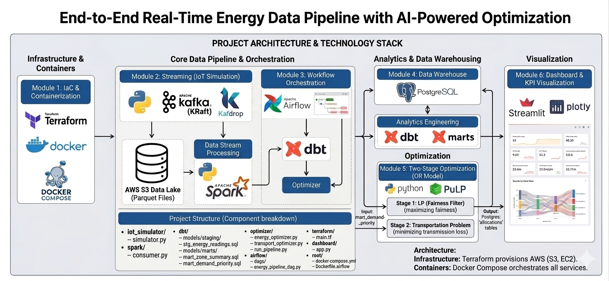

# ⚡ End-to-End Real-Time Energy Data Pipeline with AI-Powered Optimization

> A portfolio-grade, cloud-native data engineering project that simulates, streams, processes, stores, transforms, optimizes, and visualizes energy distribution data — built with Kafka, Spark, AWS, dbt, PuLP, Airflow, and Streamlit.

---

## 📌 Problem Statement

Energy grids serve multiple zones with different demands and priorities. Without intelligent allocation, high-priority zones (hospitals, critical infrastructure) may receive the same power as low-priority zones during shortage periods — and inefficient routing wastes energy through transmission loss.

This project builds a **real-time data pipeline** that:
- Continuously ingests simulated IoT energy sensor data
- Processes and stores it in a cloud data lake and warehouse
- Applies a **two-stage Operations Research optimizer** to fairly allocate energy and minimize transmission loss
- Visualizes everything in a live dashboard

---

## 🏗️ Architecture



```
┌─────────────────────────────────────────────────────────────────┐
│                        LOCAL PIPELINE                           │
│                                                                 │
│  [IoT Simulator] ──► [Kafka] ──► [Consumer] ──► [Postgres]     │
│                                       │                         │
│                                       └──────► [S3 Data Lake]  │
└─────────────────────────────────────────────────────────────────┘
                              │
                              ▼
┌─────────────────────────────────────────────────────────────────┐
│                     ORCHESTRATION LAYER                         │
│                                                                 │
│  [Airflow DAG]                                                  │
│    ├── check_new_data  (data freshness guard)                   │
│    ├── dbt_run         (transform raw → analytics)             │
│    └── run_optimizer   (two-stage OR model)                     │
└─────────────────────────────────────────────────────────────────┘
                              │
                              ▼
┌─────────────────────────────────────────────────────────────────┐
│                      ANALYTICS LAYER                            │
│                                                                 │
│  [dbt Models]                                                   │
│    ├── stg_energy_readings    (cleaned view)                    │
│    ├── mart_zone_summary      (aggregated by zone + date)      │
│    └── mart_demand_priority   (latest snapshot per zone)       │
└─────────────────────────────────────────────────────────────────┘
                              │
                              ▼
┌─────────────────────────────────────────────────────────────────┐
│                    OPTIMIZATION LAYER                           │
│                                                                 │
│  Stage 1 — LP (Fairness Filter)                                 │
│    Input:  zone demand + priority scores                        │
│    Output: fair energy allocation per zone                      │
│                                                                 │
│  Stage 2 — Transportation Problem (Routing Optimizer)           │
│    Input:  source capacities + Stage 1 allocations             │
│    Output: source → zone flows minimizing transmission loss     │
└─────────────────────────────────────────────────────────────────┘
                              │
                              ▼
┌─────────────────────────────────────────────────────────────────┐
│                      DASHBOARD LAYER                            │
│                                                                 │
│  [Streamlit] ──► Live readings, allocations, transport flows   │
└─────────────────────────────────────────────────────────────────┘

Infrastructure: Terraform provisions AWS (S3, EC2)
Containers:     Docker Compose orchestrates all services
```

---

## 🛠️ Technology Stack

| Layer | Tool | Purpose |
|---|---|---|
| IoT Simulation | Python | Generates fake energy sensor readings |
| Message Broker | Apache Kafka (KRaft) | Real-time data streaming |
| Kafka UI | Kafdrop | Monitor topics and messages |
| Stream Consumer | Python + kafka-python-ng | Reads from Kafka, writes to Postgres + S3 |
| Data Lake | AWS S3 | Stores raw Parquet files partitioned by date |
| Data Warehouse | PostgreSQL | Structured storage for analytics |
| Transformations | dbt | Staging + mart models |
| Optimization | PuLP | Linear programming + Transportation Problem |
| Orchestration | Apache Airflow | Schedules and monitors the pipeline |
| Dashboard | Streamlit + Plotly | Live visualization |
| Processing | Apache Spark | Distributed processing (master UI) |
| IaC | Terraform | Provisions AWS infrastructure |
| Containers | Docker + Compose | Packages all services |
| Cloud | AWS (S3) | Data lake storage |

---

## 📁 Project Structure

```
realtime-energy-optimization-pipeline/
├── iot_simulator/
│   ├── simulator.py          # IoT data producer → Kafka
│   └── requirements.txt
├── spark/
│   ├── consumer.py           # Kafka consumer → Postgres + S3
│   └── requirements.txt
├── dbt/
│   ├── dbt_project.yml
│   ├── profiles/
│   │   └── profiles.yml      # dbt connection config
│   └── models/
│       ├── staging/
│       │   └── stg_energy_readings.sql
│       └── marts/
│           ├── mart_zone_summary.sql
│           └── mart_demand_priority.sql
├── optimizer/
│   ├── energy_optimizer.py   # Stage 1: LP fair allocation
│   ├── transport_optimizer.py # Stage 2: Transportation routing
│   └── run_pipeline.py       # Orchestrates both stages
├── dashboard/
│   └── app.py                # Streamlit dashboard
├── airflow/
│   └── dags/
│       └── energy_pipeline_dag.py  # Airflow DAG
├── terraform/
│   ├── main.tf               # S3 bucket + encryption
│   ├── variables.tf
│   └── outputs.tf
├── Dockerfile.airflow        # Custom Airflow image with dependencies
├── docker-compose.yml        # All services
├── requirements.txt          # Local Python dependencies
└── README.md
```

---

## 🔄 Data Flow

```
1. IoT Simulator generates readings every 2 seconds per zone
   → zone, timestamp, energy_consumed_kwh, voltage, current,
     power_factor, grid_frequency, demand_priority

2. Kafka receives and buffers messages on topic: energy-readings

3. Consumer reads from Kafka:
   → Enriches data (computes apparent_power_kva)
   → Writes to Postgres (public.energy_readings)
   → Uploads batches to S3 as Parquet (partitioned by year/month/day)

4. Airflow triggers every 10 minutes:
   → check_new_data:  verifies fresh data exists
   → dbt_run:         refreshes analytics models
   → run_optimizer:   runs two-stage optimization

5. dbt transforms raw data into:
   → stg_energy_readings   (cleaned + enriched view)
   → mart_zone_summary     (daily aggregates per zone)
   → mart_demand_priority  (latest snapshot, input to optimizer)

6. Optimizer reads mart_demand_priority:
   → Stage 1 (LP): allocates 1000 kWh budget fairly by priority
   → Stage 2 (Transport): routes from 3 sources minimizing loss
   → Results saved to energy_allocations + transport_flows

7. Streamlit dashboard reads from Postgres:
   → Live zone readings
   → Allocation decisions
   → Transport flow routing
   → Energy consumption history
```

---

## ⚙️ Optimization Model

### Stage 1 — Linear Programming (Fairness Filter)

**Problem:** Given a fixed grid capacity of 1000 kWh, allocate energy to 5 zones such that high-priority zones are served first.

```
Maximize: Σ priority[z] × allocated[z]

Subject to:
  Σ allocated[z] ≤ 1000 kWh          (grid capacity)
  allocated[z] ≥ 0.6 × demand[z]     (high priority zones)
  allocated[z] ≥ 0.3 × demand[z]     (medium priority zones)
  allocated[z] ≥ 0.05 × demand[z]    (low priority zones)
```

### Stage 2 — Transportation Problem (Routing Optimizer)

**Problem:** Route power from 3 sources (Solar 300kWh, Gas 400kWh, Hydro 300kWh) to 5 zones minimizing transmission loss.

```
Minimize: Σ loss[s][z] × flow[s][z]

Subject to:
  Σ flow[s][z] ≤ capacity[s]          (source capacity)
  Σ flow[s][z] = allocated[z]         (meet Stage 1 targets)
  flow[s][z] ≥ 0

Where: loss[s][z] = 0.01 × euclidean_distance(source, zone)
```

**Result:** ~3% total transmission loss — the optimizer routes power through the shortest paths automatically.

---

## 🚀 Getting Started

### Prerequisites

- Docker Desktop installed and running
- Python 3.10–3.12 (3.14 has Kafka compatibility issues)
- AWS account with S3 access
- AWS CLI configured (`aws configure`)
- Terraform (via Docker image — no installation needed)

### 1. Clone the Repository

```bash
git clone https://github.com/yusuufdevops/realtime-energy-optimization-pipeline.git
cd realtime-energy-optimization-pipeline
```

### 2. Install Python Dependencies

```bash
pip install -r requirements.txt
```

### 3. Configure AWS Credentials

```bash
aws configure
# Enter your Access Key, Secret Key, region: us-east-1, format: json
```

### 4. Provision AWS Infrastructure

```bash
cd terraform
docker run --rm -it \
  -v ${PWD}:/workspace \
  -v ${HOME}/.aws:/root/.aws \
  -w /workspace \
  hashicorp/terraform:latest init

docker run --rm -it \
  -v ${PWD}:/workspace \
  -v ${HOME}/.aws:/root/.aws \
  -w /workspace \
  hashicorp/terraform:latest apply
cd ..
```

### 5. Start Core Services

```bash
# Build custom Airflow image (first time only)
docker-compose build airflow-init airflow-standalone

# Start Postgres and Kafka
docker-compose up -d postgres kafka kafdrop spark

# Initialize Airflow database (first time only)
docker-compose up -d airflow-init
docker logs -f airflow-init  # wait for "Database migrating done!"

# Start Airflow
docker-compose up -d airflow-standalone
docker logs -f airflow-standalone  # note the admin password
```

### 6. Set Up the Database

```bash
# Create energy readings table
docker exec -it postgres psql -U energy_user -d energy_db -c "
CREATE TABLE IF NOT EXISTS public.energy_readings (
    id SERIAL PRIMARY KEY,
    zone VARCHAR(20),
    timestamp TIMESTAMP,
    energy_consumed_kwh FLOAT,
    voltage FLOAT,
    current_amperes FLOAT,
    power_factor FLOAT,
    grid_frequency_hz FLOAT,
    demand_priority VARCHAR(10),
    apparent_power_kva FLOAT,
    ingested_at TIMESTAMP DEFAULT NOW()
);

CREATE TABLE IF NOT EXISTS public.energy_allocations (
    id SERIAL PRIMARY KEY,
    run_time TIMESTAMP DEFAULT NOW(),
    zone VARCHAR(20),
    demand_kwh FLOAT,
    priority_score INT,
    allocated_kwh FLOAT,
    allocation_pct FLOAT,
    status VARCHAR(20)
);

CREATE TABLE IF NOT EXISTS public.energy_sources (
    id SERIAL PRIMARY KEY,
    source_name VARCHAR(50),
    source_type VARCHAR(20),
    capacity_kwh FLOAT,
    location_x FLOAT,
    location_y FLOAT
);

INSERT INTO public.energy_sources (source_name, source_type, capacity_kwh, location_x, location_y)
VALUES
    ('Solar Plant Alpha', 'solar', 300.0, 1.0, 1.0),
    ('Gas Plant Beta',    'gas',   400.0, 5.0, 5.0),
    ('Hydro Plant Gamma', 'hydro', 300.0, 9.0, 9.0);

CREATE TABLE IF NOT EXISTS public.transport_flows (
    id SERIAL PRIMARY KEY,
    run_time TIMESTAMP DEFAULT NOW(),
    source_name VARCHAR(50),
    zone VARCHAR(20),
    flow_kwh FLOAT,
    transmission_loss_pct FLOAT,
    effective_kwh FLOAT,
    cost FLOAT
);"
```

### 7. Run dbt Models

```bash
docker run --rm -it \
  -v ${PWD}/dbt:/usr/app \
  -v ${PWD}/dbt/profiles:/root/.dbt \
  --network host \
  ghcr.io/dbt-labs/dbt-postgres:latest \
  run
```

### 8. Start the Pipeline

**Terminal 1 — IoT Simulator:**
```bash
python iot_simulator/simulator.py
```

**Terminal 2 — Kafka Consumer:**
```bash
python spark/consumer.py
```

### 9. Launch the Dashboard

```bash
cd dashboard
python -m streamlit run app.py
```

Open `http://localhost:8501`

### 10. Access Service UIs

| Service | URL | Credentials |
|---|---|---|
| Streamlit Dashboard | http://localhost:8501 | — |
| Airflow | http://localhost:8085 | admin / (see logs) |
| Kafdrop (Kafka UI) | http://localhost:9000 | — |
| Spark UI | http://localhost:8080 | — |

---

## 📊 Dashboard

The Streamlit dashboard provides:

- **KPI Cards** — Total demand, allocated power, effective power, transmission loss, average voltage
- **Live Zone Readings** — Bar chart of current energy consumption colored by priority
- **Stage 1 Allocation** — Demand vs allocated comparison per zone
- **Stage 2 Transport Routing** — Sunburst chart showing source → zone power flows
- **Energy History** — Time series of consumption across all zones
- **Data Tables** — Allocation decisions and transport flows

---

## 🗂️ dbt Models

| Model | Type | Description |
|---|---|---|
| `stg_energy_readings` | View | Cleans raw readings, adds priority score and active power |
| `mart_zone_summary` | Table | Daily aggregates per zone (avg, peak, min energy) |
| `mart_demand_priority` | Table | Latest reading per zone — direct input to optimizer |

---
---

## 🗄️ Data Warehouse Design

The `energy_readings` table is **partitioned by `ingested_at`** using PostgreSQL range partitioning:

```text
energy_readings (partitioned)
├── energy_readings_2026_04  → April data
├── energy_readings_2026_05  → May data
└── energy_readings_2026_06  → June data
```

**Why partitioning makes sense here:**
- Dashboard queries filter by recent time windows (`WHERE ingested_at >= NOW() - INTERVAL '15 minutes'`)
- dbt models aggregate by date (`GROUP BY DATE(reading_time)`)
- The optimizer reads only the latest snapshot per zone

Without partitioning, every query scans the entire table. With partitioning, Postgres eliminates irrelevant partitions automatically — this is called **partition pruning**.

The table also has two indexes:
- `idx_energy_readings_zone` — speeds up zone-level GROUP BY queries
- `idx_energy_readings_ingested` — speeds up time-range filters
---
## 🔁 Airflow DAG

**DAG:** `energy_pipeline`
**Schedule:** Every 10 minutes (`*/10 * * * *`)

```
check_new_data → dbt_run → run_optimizer
```

| Task | Operator | Description |
|---|---|---|
| `check_new_data` | PythonOperator | Fails if no data in last 15 minutes |
| `dbt_run` | BashOperator | Runs dbt models inside Airflow container |
| `run_optimizer` | PythonOperator | Runs Stage 1 LP + Stage 2 Transportation |

---

## ☁️ AWS Infrastructure (Terraform)

```hcl
resource "aws_s3_bucket" "energy_data_lake" {
  bucket = "energy-data-lake-yusuufdevops"
}
```

- **S3 Bucket** — Data lake with versioning and AES256 encryption
- **Parquet files** — Partitioned by `year/month/day`

---

## 🧠 What This Project Demonstrates

| Skill | Implementation |
|---|---|
| Stream Processing | Kafka KRaft + Python consumer |
| Data Lake | S3 with partitioned Parquet files |
| Data Warehouse | PostgreSQL with analytical schema |
| Transformations | dbt staging + mart models |
| Orchestration | Airflow DAG with dependency chain |
| Operations Research | Two-stage LP + Transportation optimizer |
| Cloud + IaC | AWS S3 provisioned with Terraform |
| Containerization | Full Docker Compose stack |
| Visualization | Streamlit + Plotly dashboard |

---
---

## 🤝 Author

**Yusuuf** — Data Engineer | Operations Research | Cloud  
GitHub: [@yusuuf-mm](https://github.com/yusuuf-mm)
